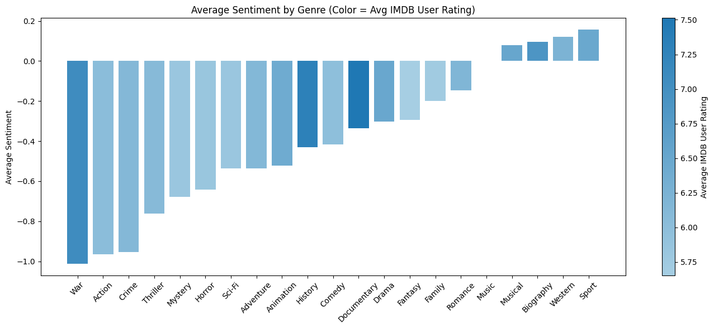
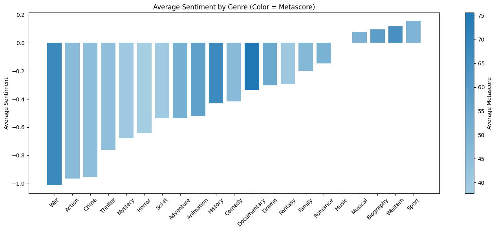

# Movie Sentiment Analysis: IMDB vs Metacritic
A comprehensive analysis of movie description sentiment compared to critic and user ratings, broken down by genre.
# Project Overview
This project combines web scraping, natural language processing, and statistical analysis to explore the relationship between movie description sentiment and actual ratings. The analysis uses data from both IMDB and Metacritic to compare how sentiment analysis of movie descriptions correlates with professional critic scores and user ratings across different genres.
# Key Features

Data Pipeline: MongoDB integration with custom aggregation pipelines
NLP Analysis: Advanced sentiment analysis using XLM-RoBERTa transformer model
Statistical Modeling: Regression analysis to identify correlations
Data Visualization: Genre-based analysis with color-coded rating visualizations
Multi-source Integration: Combines IMDB and Metacritic datasets

# Technologies Used

Python: Core programming language
MongoDB: Database storage and aggregation pipelines
Transformers (Hugging Face): XLM-RoBERTa sentiment analysis model
Pandas: Data manipulation and analysis
Statsmodels: Regression analysis
Matplotlib/Seaborn: Data visualization
PyMongo: MongoDB Python driver

# Dataset
The analysis uses movie data from:

IMDB: User ratings, budget, release year, genres, descriptions
Metacritic: Professional critic scores, user scores
Time Period: Movies from 2000 onwards
Merge Strategy: Inner join on movie titles

# Key Findings
# Statistical Results

Weak correlation between description sentiment and ratings overall
Genre shows stronger correlation than aggregate ratings
War movies: negative sentiment but high quality ratings
Western films surprisingly rank as most "positive" genre

# Methodology Insights

<h1>Findings</h1>
<ul>Our regression analysis told us there wasn't a strong correlation between sentiment and genre. Perhaps it should also be run with other years.  I wonder how different the data would look.</ul>
<ul>I think that it likely changes a good amount over time, as genre conventions can go through trends and target audiences can change drastically.</ul>
<ul>Regardless, it is interesting to plot these sort of relationships with categorical variables, as they often beget more and more questions and future data explorations.</ul>
<ul>I think one of the most interesting datapoints here is Western films being one of 4 'positive' genres! I think the genre has roots in really violent, really macho style movies (John Wayne is cancelled though).  It is so curious to see it above Music! </ul>
<ul>To be honest, the color gradient was a lot of work and I don't think it really tells us much...except that War movies are depressing and really good! Actually that is really interesting.  Everything else with a similarly negative sentiment has low average metascores. Well actually the color gradient is interesting, I just think that metascore and imdb rating basically tell the same story here.  I think a further exploration into where and how they diverge would be interesting.

I think there may be an element of small sample size with the war genre.  It is popular but it is often really high production value stuff. Whereas movies are sort of churned out a dime a dozen.

Perhaps that is worth looking into, genre saturation ~ average score.  I think the problem with movie stuff is its really hard to parse. Our dataset breaks things up into broad strokes, but I think that is on us to whittle and whittle until we can really find the vein.  I think I want to keep exploring this sort of stuff. I feel I only scratched the surface.</ul>

## Sample Results

### Genre Sentiment Analysis

